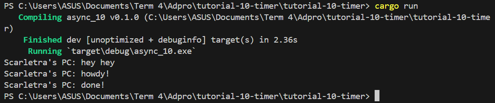
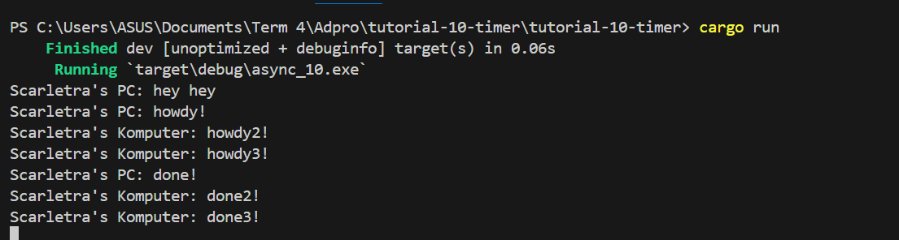
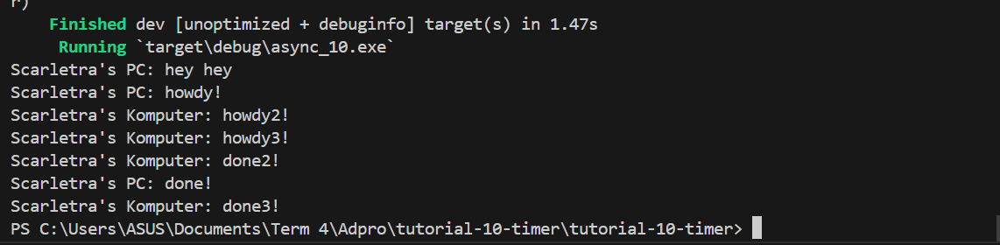

Dari screenshot di atas, dapat dilihat bahwa output dari program tersebut secara berurutan adalah "hey hey" dan diikuti oleh "howdy!" "done!". Hal ini disebabkan "hey hey" berada di luar fungsi async yang mana akan terus melanjutkan program hingga selesai sambil menunggu hasil dari future yaitu dalam konteks ini mencetak "howdy!" dan "done!".

Tanpa drop(spawner)

Dengan drop(spawner)

Dari kedua screenshot di atas, dapat diketahui bahwa ketika kita menghilangkan drop(spawner), program tidak akan pernah berhenti karena program akan mengasumsikan bahwa masih akan ada transisi data oleh spawner. Hal ini disebabkan fungsi drop(spawner) adalah fungsi yang mengindikasikan bahwa spawner sudah tidak digunakan dan akan ditutup. Dari output yang dihasilkan pada kedua gambar di atas, kita tahu bahwa dengan adanya banyak spawner menyebabkan banyak tugas yang harus dilakukan dan ini berlaku layaknya antrian (queue) dalam pengiriman pesan (dalam konteks tutorial ini). Ketika sebuah spawner memanggil fungsi spawn, akan dibuat sebuah tugas baru yang dikirimkan ke pengirim tugas dalam tutorial ini yaitu tugas untuk mencetak pesan. Eksekutor akan mengambil satu tugas dari pengirim tugas dan menjalankannya, kemudian mengambil tugas lainnya sampai tugas habis dan spawner di-drop dengan drop(spawner) yang menandakan interaksi sudah selesai. 